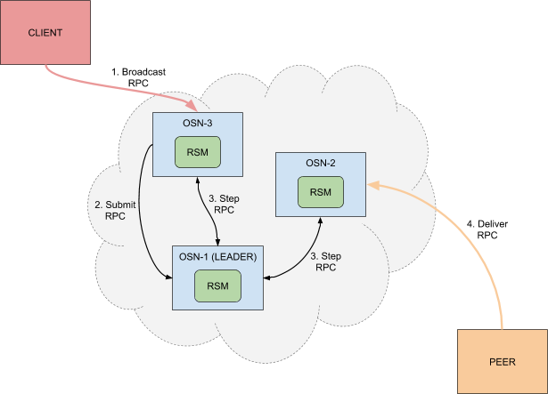

# 在Fabric 1.4.2 中使用并分析 Raft 共识

## 1. 前言

`Raft`是在`Fabric 1.4.1`版本中推出的继`solo`和`kafka`之后的一个新的共识插件，相比于`kafka`而言，`Raft`更加简单方便，更加适用于在生产环境中使用。

## 2. 共识机制简介

**共识**(`consensus`)在很多时候会与**一致性**(`consistency`)术语放在一起讨论。严谨上来讲，这两者的含义并不完全相同。

- 一致性往往指分布式系统中多个副本对外呈现的数据的状态。
- 共识机制则描述了分布式系统中多个节点之间，彼此对某个状态达成一致结果的过程。

现在的共识算法可以分为两类，一类是拜占庭错误(`Byzantine Fault Tolerance`)类算法，也称为`BFT`类；还有一类是非拜占庭错误(`Crash Fault Tolerance`)类算法，也称为`CFT`。这两类的区别主要在于节点是否会出现伪造信息的情况。`BFT`类算法就是解决那些节点会出现恶意伪造信息的问题，这类算法主要有`PBFT`为代表的确定性系列算法、`PoW`为代表的概率算法等。`CFT`类算法主要是解决那些节点会出现故障，例如网络故障，网络延迟等，但是不会出现恶意伪造信息的问题，这类算法主要有`Paxos`系列算法、`Raft`算法和`kafka`+`zookeeper`等。

>**问：**为什么在`Fabric`中不使用更加能保证安全的`BFT`类共识算法？
>
>首先，在`Fabric`中因为存在权限机制，节点已经通过数字证书保护了，所以出现节点作恶的几率是非常小的；其次，`BFT`类的共识算法需要`3n+1`的节点来处理故障。例如，要处理`BFT`中的`100`个恶意的节点，我们最少需要`301（3*100 + 1）`个节点来保证安全。而`Raft`共识仅需要`2n+1（2*100 + 1）`个节点来解决容错问题，与前者相比，综合考虑，使用`Raft`共识的成本最低，效益也最好。

## 3. Raft 共识简介

在`Raft`共识中，节点有三种状态，如下图所示：


- `Follower`（跟随者）：最初所有的节点都会处于这个状态，如果`Follower`的倒计时结束(`Timeout`)后，他就会成为`Candidate`开始选举，`Follower`的日志可以被`Leader`覆盖
- `Candidate`（候选者）：每个节点上都有一个倒计时器(`Election Timeout`)，当一个节点的倒计时结束后，该节点就会变成`Candidate`，开始启动选举，向其他几个节点发送选举请求(`RequestVote`)，如果获得多数票，将会成为`Leader`
- `Leader`（领导者）：当一个节点成为`Leader`后，会在每个一小段时间后，就给所有的`Follower`发送一个`Heartbeat`以保持所有节点的状态，`Follower`收到`Leader`的`Heartbeat`后重设`Timeout`。`Leader`处理客户端请求并确保所有`Follower`具有相同的日志副本。

在`Raft`共识中，最主要进行的两个活动是选主(`Leader Election`)和复制日志(`Log Replication`)。原理这里就不再介绍了，可以参考[共识算法：Raft](https://www.jianshu.com/p/8e4bbe7e276c)这篇文章，或者查看[Raft 动画演示](http://thesecretlivesofdata.com/raft/#home)。我们将下面结合具体的`first-network`实例进行分析。其中就有选主和复制日志的过程。

## 4. 在 First-network 例子中使用 Raft 共识

### 4.1 基本概念

在最新的`Fabric` 版本中，基于`Raft`共识的排序服务取代了现有的`kafka`+`zookeeper`的模式。在`orderer`服务集群中，每个节点都有自己的`Raft`状态机(`RSM`)来提交日志。`Client`(客户端)将使用`Broadcast RPC`发送交提案，`Raft OSN`将根据共识形成一个区块，当`peer`节点发出`Deliver RPC`是，就将区块发送给`peer`节点。



每个通道都将在`Raft`协议的单独实例上运行，也就是说，如果一个网络中有`N`个`Channel`，那么意味着我们就有`N`个`Raft`集群，每个集群中都有自己的领导者。

### 4.2 `Raft`共识的相关配置文件

在最新版本的`first-network`例子中，已经写好了启用`Raft`共识的配置了。这里我们先分析一下具体它是如何启用的。

首先我们来看我们的启动脚本`byfn.sh`，在`printHelp()`中还没有定义与使用`Raft`共识的相关说明。这可能是还没来得及修改更新。但是我们在`networkUp()`函数中可以看到出现了`etcdraft`的字眼。在`169~171`行，根据脚本的逻辑，我们可以知道，当`CONSENSUS_TYPE`为`etcdraft`时，我们的`docker-compose`启动配置文件将增加一项`COMPOSE_FILE_RAFT2`，该变量的值就是`docker-compose-etcdraft2.yaml`，我们在`first-network`目录下可以看到这个`YAML`文件，打开这个文件我们可以看到，里面定义了四个`orderer`排序节点服务，加上`docker-compose-cli.yaml`文件中定义的一个`orderer`排序节点服务，刚好组成一个由五个`orderer`节点构成的排序服务集群。

只是在启动服务的时候多启动几台`orderer`节点就能使用`Raft`共识了吗，当然不是。之前我们在`《手动启动 Fabric 1.4.2 并解析全过程》`中已经分析过了`configtx.yaml`文件，在这个文件中，就有关于`etcdraft`的配置，我们可以在`configtx.yaml`文件的最后一项`Profiles`中看到，其中有一项`profile`叫做`SampleMultiNodeEtcdRaft`，如下:

```yaml
SampleMultiNodeEtcdRaft:
        <<: *ChannelDefaults # 合并引入 Channel 的配置
        Capabilities:
            <<: *ChannelCapabilities # 合并引入 channel的能力（Capabilities）配置
        Orderer:
            <<: *OrdererDefaults # 合并引入 orderer 的配置
            OrdererType: etcdraft # 定义 orderer 排序使用的共识为 etcdraft
            EtcdRaft: # 定义有关 raft 共识的配置信息
                Consenters: # 定义所有参与共识的 orderer 节点信息
                - Host: orderer.example.com # 域名
                  Port: 7050 # 端口
                  # 客户端 TLS 证书
                  ClientTLSCert: crypto-config/ordererOrganizations/example.com/orderers/orderer.example.com/tls/server.crt
                  # 服务端TLS 证书
                  ServerTLSCert: crypto-config/ordererOrganizations/example.com/orderers/orderer.example.com/tls/server.crt
                - Host: orderer2.example.com
                  Port: 7050
                  ClientTLSCert: crypto-config/ordererOrganizations/example.com/orderers/orderer2.example.com/tls/server.crt
                  ServerTLSCert: crypto-config/ordererOrganizations/example.com/orderers/orderer2.example.com/tls/server.crt
                - Host: orderer3.example.com
                  Port: 7050
                  ClientTLSCert: crypto-config/ordererOrganizations/example.com/orderers/orderer3.example.com/tls/server.crt
                  ServerTLSCert: crypto-config/ordererOrganizations/example.com/orderers/orderer3.example.com/tls/server.crt
                - Host: orderer4.example.com
                  Port: 7050
                  ClientTLSCert: crypto-config/ordererOrganizations/example.com/orderers/orderer4.example.com/tls/server.crt
                  ServerTLSCert: crypto-config/ordererOrganizations/example.com/orderers/orderer4.example.com/tls/server.crt
                - Host: orderer5.example.com
                  Port: 7050
                  ClientTLSCert: crypto-config/ordererOrganizations/example.com/orderers/orderer5.example.com/tls/server.crt
                  ServerTLSCert: crypto-config/ordererOrganizations/example.com/orderers/orderer5.example.com/tls/server.crt
            # 定义 orderer 集群的地址数组
            Addresses:
                - orderer.example.com:7050
                - orderer2.example.com:7050
                - orderer3.example.com:7050
                - orderer4.example.com:7050
                - orderer5.example.com:7050

            Organizations: # 引入 Orderer 组织配置
            - *OrdererOrg
            Capabilities:
                <<: *OrdererCapabilities
        Application: # 应用部分
            <<: *ApplicationDefaults
            Organizations:
            - <<: *OrdererOrg
        Consortiums: # 联盟定义
            SampleConsortium:
                Organizations: # 由 org1 和 org2 组成的联盟
                - *Org1
                - *Org2
```

我们之前介绍过，这个配置定义主要是用来生成`orderer`排序服务启动的创世区块用的，那么如果要使用`Raft`共识，就必须要使用这个配置来生成创世区块，我们回到`byfn.sh`启动的脚本文件中，找到生成创世区块等文件的方法`generateChannelArtifacts()`，在这个方法中，我们可以很清楚的看到，确实是根据排序服务(`CONSENSUS_TYPE`)的不一样，生成创世区块使用到的`-profile`配置也不一样，我们在`429`行位置可以看到使用`raft`共识创建创世区块的命令为：

```bash
configtxgen -profile SampleMultiNodeEtcdRaft -channelID $SYS_CHANNEL -outputBlock ./channel-artifacts/genesis.block
```

很明显，指定的`profile`配置就是我们之前在`configtx.yaml`中分析了`SampleMultiNodeEtcdRaft`。

### 4.3 启动网络并分析日志

我们在`byfn.sh`脚本文件中的`536~576`代码行可以看到，我要想定义`CONSENSUS_TYPE`变量的值，只需要指定`-o`参数即可，所以，我们启动网络的命令为：

```bash
# 如果不在 first-network 目录，先进入该目录下
cd /opt/gopath/src/github.com/hyperledger/fabric/scripts/fabric-samples/first-network
# 启动网络
./byfn.sh up -o etcdraft
```

下面我们来一步步通过日志分析其过程，首先我们看到`Generating Orderer Genesis block`部分有如下输出，其中显示`orderer type`为`etcdraft`。

```bash
/usr/local/bin/configtxgen
##########################################################
#########  Generating Orderer Genesis block ##############
##########################################################
CONSENSUS_TYPE=etcdraft
+ '[' etcdraft == solo ']'
+ '[' etcdraft == kafka ']'
+ '[' etcdraft == etcdraft ']'
+ configtxgen -profile SampleMultiNodeEtcdRaft -channelID byfn-sys-channel -outputBlock ./channel-artifacts/genesis.block
2019-08-21 12:30:12.493 EDT [common.tools.configtxgen] main -> INFO 001 Loading configuration
2019-08-21 12:30:12.569 EDT [common.tools.configtxgen.localconfig] completeInitialization -> INFO 002 orderer type: etcdraft
2019-08-21 12:30:12.569 EDT [common.tools.configtxgen.localconfig] completeInitialization -> INFO 003 Orderer.EtcdRaft.Options unset, setting to tick_interval:"500ms" election_tick:10 heartbeat_tick:1 max_inflight_blocks:5 snapshot_interval_size:20971520
```

其次，我们会发现输出启动的容器如下，可以看到五个`orderer`排序服务都已经启动了。

```bash
CONTAINER ID        IMAGE                               COMMAND             CREATED             STATUS                  PORTS                      NAMES
d6e1a0f80774        hyperledger/fabric-tools:latest     "/bin/bash"         2 seconds ago       Up Less than a second                              cli
d27c5b95b933        hyperledger/fabric-peer:latest      "peer node start"   9 seconds ago       Up 1 second             0.0.0.0:9051->9051/tcp     peer0.org2.example.com
e450d808e22b        hyperledger/fabric-peer:latest      "peer node start"   9 seconds ago       Up 1 second             0.0.0.0:7051->7051/tcp     peer0.org1.example.com
82be5e4a23fc        hyperledger/fabric-orderer:latest   "orderer"           9 seconds ago       Up 1 second             0.0.0.0:7050->7050/tcp     orderer.example.com
f26aa248eef3        hyperledger/fabric-peer:latest      "peer node start"   9 seconds ago       Up 1 second             0.0.0.0:8051->8051/tcp     peer1.org1.example.com
7d17062c4a6f        hyperledger/fabric-orderer:latest   "orderer"           9 seconds ago       Up 1 second             0.0.0.0:10050->7050/tcp    orderer4.example.com
7e0ac9d283bf        hyperledger/fabric-orderer:latest   "orderer"           9 seconds ago       Up 1 second             0.0.0.0:11050->7050/tcp    orderer5.example.com
2370d8cfb326        hyperledger/fabric-peer:latest      "peer node start"   9 seconds ago       Up 1 second             0.0.0.0:10051->10051/tcp   peer1.org2.example.com
0e6cbc77dd68        hyperledger/fabric-orderer:latest   "orderer"           9 seconds ago       Up 1 second             0.0.0.0:8050->7050/tcp     orderer2.example.com
dd27672debb2        hyperledger/fabric-orderer:latest   "orderer"           9 seconds ago       Up 1 second             0.0.0.0:9050->7050/tcp     orderer3.example.com
```

在输出的启动容器列表日志下面，我们可以看到，有这里一行日志输出，翻译过来就是：睡眠`15`秒，让`raft`集群启动完成。

```bash
Sleeping 15s to allow etcdraft cluster to complete booting
```

那么这五个`orderer`节点究竟在这`15`秒干了什么，我们来看看他们的日志，首先，我们新建一个终端，使用`docker logs orderer.example.com`来查看其日志。在日志中，我们可以很容易看到，有关`raft`的日志消息一般以`2019-08-21 16:47:34.185 UTC [orderer.consensus.etcdraft]`类似的开头出现，那么我们先一步步分析`orderer.example.com`这个节点的日志。

#### 4.3.1 `orderer.example.com`容器日志分析

```bash
# 本地配置完成初始化，kafka 的版本未定义，使用 0.10.2.0 版本
2019-08-21 17:05:34.668 UTC [localconfig] completeInitialization -> INFO 001 Kafka.Version unset, setting to 0.10.2.0
# 打印 orderer.example.com 节点的所有配置信息
2019-08-21 17:05:34.780 UTC [orderer.common.server] prettyPrintStruct -> INFO 002 Orderer config values:
  General.LedgerType = "file"
  General.ListenAddress = "0.0.0.0"
  General.ListenPort = 7050
  General.TLS.Enabled = true
  
  #......
  # 省略相关内容
  #......
  
# 提前系统上次的配置：不存在配置
2019-08-21 17:05:34.836 UTC [orderer.common.server] extractSysChanLastConfig -> INFO 003 Bootstrapping because no existing channels
# 启动 orderer 节点服务，开启TLS
2019-08-21 17:05:34.906 UTC [orderer.common.server] initializeServerConfig -> INFO 004 Starting orderer with TLS enabled
# 使用默认的端口 7050
2019-08-21 17:05:34.906 UTC [orderer.common.server] configureClusterListener -> INFO 005 Cluster listener is not configured, defaulting to use the general listener on port 7050
# 从提前生成的创世区块中获取区块信息
2019-08-21 17:05:34.907 UTC [fsblkstorage] newBlockfileMgr -> INFO 006 Getting block information from block storage
#（raft内容）EvictionSuspicion 没有设置，使用默认的 10m0s
2019-08-21 17:05:34.944 UTC [orderer.consensus.etcdraft] HandleChain -> INFO 007 EvictionSuspicion not set, defaulting to 10m0s
#（raft内容）WAL(Write Ahead Logs)目录的创建或读取：这个配置在orderer.yaml文件中有定义，是 raft 共识存储每个特定通道的 WAL 用到的目录，每个通道都有一个其ID名字的文件夹。这里是，创建了系统通道的文件夹(wal/byfn-sys-channel)
2019-08-21 17:05:34.944 UTC [orderer.consensus.etcdraft] createOrReadWAL -> INFO 008 No WAL data found, creating new WAL at path '/var/hyperledger/production/orderer/etcdraft/wal/byfn-sys-channel' channel=byfn-sys-channel node=1
#（raft内容）使用创世区块和 raft排序服务初始化系统通道
2019-08-21 17:05:34.954 UTC [orderer.commmon.multichannel] Initialize -> INFO 009 Starting system channel 'byfn-sys-channel' with genesis block hash 00472d8f434b350fcddc6658e869a15a90fddba946bf65c9643a68c5c8da7417 and orderer type etcdraft
#（raft内容）在系统通道 byfn-sys-channel 中启动 Raft 共识节点 node=1，
2019-08-21 17:05:34.955 UTC [orderer.consensus.etcdraft] Start -> INFO 00a Starting Raft node channel=byfn-sys-channel node=1
# 配置与其他四个 orderer 节点进行通信的信息，包括节点地址和端口，以及TLS通信的服务端证书和客户端证书
2019-08-21 17:05:34.955 UTC [orderer.common.cluster] Configure -> INFO 00b Entering, channel: byfn-sys-channel, nodes: [ID: 2,
Endpoint: orderer2.example.com:7050,
ServerTLSCert:-----BEGIN CERTIFICATE-----
# 省略内容
-----END CERTIFICATE-----
, ClientTLSCert:-----BEGIN CERTIFICATE-----
# 省略内容
-----END CERTIFICATE-----
 ID: 3,
Endpoint: orderer3.example.com:7050,
ServerTLSCert:-----BEGIN CERTIFICATE-----
# 省略内容
-----END CERTIFICATE-----
, ClientTLSCert:-----BEGIN CERTIFICATE-----
# 省略内容
-----END CERTIFICATE-----
 ID: 4,
Endpoint: orderer4.example.com:7050,
ServerTLSCert:-----BEGIN CERTIFICATE-----
# 省略内容
-----END CERTIFICATE-----
, ClientTLSCert:-----BEGIN CERTIFICATE-----
# 省略内容
-----END CERTIFICATE-----
 ID: 5,
Endpoint: orderer5.example.com:7050,
ServerTLSCert:-----BEGIN CERTIFICATE-----
# 省略内容
-----END CERTIFICATE-----
, ClientTLSCert:-----BEGIN CERTIFICATE-----
# 省略内容
-----END CERTIFICATE-----
]

# 在系统通道中为 node 2 分配新的 stub，也就是指定 node 2 就是 orderer 2
2019-08-21 17:05:34.955 UTC [orderer.common.cluster] updateStubInMapping -> INFO 00c Allocating a new stub for node 2 with endpoint of orderer2.example.com:7050 for channel byfn-sys-channel
# 由于 TLS 证书的变更停用 node 2
2019-08-21 17:05:34.955 UTC [orderer.common.cluster] updateStubInMapping -> INFO 00d Deactivating node 2 in channel byfn-sys-channel with endpoint of orderer2.example.com:7050 due to TLS certificate change
# 在系统通道中为 node 3 分配新的 stub，也就是指定 node 3 就是 orderer 3
2019-08-21 17:05:34.956 UTC [orderer.common.cluster] updateStubInMapping -> INFO 00e Allocating a new stub for node 3 with endpoint of orderer3.example.com:7050 for channel byfn-sys-channel
# 由于 TLS 证书的变更停用 node 3
2019-08-21 17:05:34.956 UTC [orderer.common.cluster] updateStubInMapping -> INFO 00f Deactivating node 3 in channel byfn-sys-channel with endpoint of orderer3.example.com:7050 due to TLS certificate change
# 在系统通道中为 node 4 分配新的 stub，也就是指定 node 4 就是 orderer 4
2019-08-21 17:05:34.957 UTC [orderer.common.cluster] updateStubInMapping -> INFO 010 Allocating a new stub for node 4 with endpoint of orderer4.example.com:7050 for channel byfn-sys-channel
# 由于 TLS 证书的变更停用 node 4
2019-08-21 17:05:34.957 UTC [orderer.common.cluster] updateStubInMapping -> INFO 011 Deactivating node 4 in channel byfn-sys-channel with endpoint of orderer4.example.com:7050 due to TLS certificate change
# 在系统通道中为 node 5 分配新的 stub，也就是指定 node 5 就是 orderer 5
2019-08-21 17:05:34.958 UTC [orderer.common.cluster] updateStubInMapping -> INFO 012 Allocating a new stub for node 5 with endpoint of orderer5.example.com:7050 for channel byfn-sys-channel
# 由于 TLS 证书的变更停用 node 5
2019-08-21 17:05:34.961 UTC [orderer.common.cluster] updateStubInMapping -> INFO 013 Deactivating node 5 in channel byfn-sys-channel with endpoint of orderer5.example.com:7050 due to TLS certificate change
#  node 2 在 old And new membership 中都存在，跳过停用
2019-08-21 17:05:34.961 UTC [orderer.common.cluster] applyMembershipConfig -> INFO 014 2 exists in both old and new membership for channel byfn-sys-channel , skipping its deactivation
#  node 3 在 old And new membership 中都存在，跳过停用
2019-08-21 17:05:34.961 UTC [orderer.common.cluster] applyMembershipConfig -> INFO 015 3 exists in both old and new membership for channel byfn-sys-channel , skipping its deactivation
#  node 4 在 old And new membership 中都存在，跳过停用
2019-08-21 17:05:34.961 UTC [orderer.common.cluster] applyMembershipConfig -> INFO 016 4 exists in both old and new membership for channel byfn-sys-channel , skipping its deactivation
#  node 5 在 old And new membership 中都存在，跳过停用
2019-08-21 17:05:34.961 UTC [orderer.common.cluster] applyMembershipConfig -> INFO 017 5 exists in both old and new membership for channel byfn-sys-channel , skipping its deactivation
# 集群配置结束，退出
2019-08-21 17:05:34.961 UTC [orderer.common.cluster] Configure -> INFO 018 Exiting
#（raft内容）启动 Raft node 1 作为在系统通道 byfn-sys-channel 的一部分
2019-08-21 17:05:34.961 UTC [orderer.consensus.etcdraft] start -> INFO 019 Starting raft node as part of a new channel channel=byfn-sys-channel node=1
#（raft内容）node 1 成为 follower 在第 0 轮选举中（term 0）
2019-08-21 17:05:34.961 UTC [orderer.consensus.etcdraft] becomeFollower -> INFO 01a 1 became follower at term 0 channel=byfn-sys-channel node=1
2019-08-21 17:05:34.962 UTC [orderer.consensus.etcdraft] newRaft -> INFO 01b newRaft 1 [peers: [], term: 0, commit: 0, applied: 0, lastindex: 0, lastterm: 0] channel=byfn-sys-channel node=1
#（raft内容）node 1 成为 follower 在第 1 轮选举中（term 1）
2019-08-21 17:05:34.962 UTC [orderer.consensus.etcdraft] becomeFollower -> INFO 01c 1 became follower at term 1 channel=byfn-sys-channel node=1
# 启动orderer节点服务
2019-08-21 17:05:34.962 UTC [orderer.common.server] Start -> INFO 01d Starting orderer:
 Version: 1.4.2
 Commit SHA: c6cc550
 Go version: go1.11.5
 OS/Arch: linux/amd64
#开始请求服务数据
2019-08-21 17:05:34.962 UTC [orderer.common.server] Start -> INFO 01e Beginning to serve requests
#（raft内容）应用配置更改，添加 node 1
2019-08-21 17:05:34.974 UTC [orderer.consensus.etcdraft] apply -> INFO 01f Applied config change to add node 1, current nodes in channel: [1 2 3 4 5] channel=byfn-sys-channel node=1
#（raft内容）应用配置更改，添加 node 2
2019-08-21 17:05:34.974 UTC [orderer.consensus.etcdraft] apply -> INFO 020 Applied config change to add node 2, current nodes in channel: [1 2 3 4 5] channel=byfn-sys-channel node=1
#（raft内容）应用配置更改，添加 node 3
2019-08-21 17:05:34.974 UTC [orderer.consensus.etcdraft] apply -> INFO 021 Applied config change to add node 3, current nodes in channel: [1 2 3 4 5] channel=byfn-sys-channel node=1
#（raft内容）应用配置更改，添加 node 4
2019-08-21 17:05:34.975 UTC [orderer.consensus.etcdraft] apply -> INFO 022 Applied config change to add node 4, current nodes in channel: [1 2 3 4 5] channel=byfn-sys-channel node=1
#（raft内容）应用配置更改，添加 node 5
2019-08-21 17:05:34.975 UTC [orderer.consensus.etcdraft] apply -> INFO 023 Applied config change to add node 5, current nodes in channel: [1 2 3 4 5] channel=byfn-sys-channel node=1
#（raft内容）从 node 5 获取到了更高选举轮数（term 2）的信息，也就是说 node 5 开始了第 2 轮选举
2019-08-21 17:05:35.889 UTC [orderer.consensus.etcdraft] Step -> INFO 024 1 [term: 1] received a MsgApp message with higher term from 5 [term: 2] channel=byfn-sys-channel node=1
#（raft内容）node 1 在 第二轮选举（term 2）中成为 follower
2019-08-21 17:05:35.889 UTC [orderer.consensus.etcdraft] becomeFollower -> INFO 025 1 became follower at term 2 channel=byfn-sys-channel node=1
#（raft内容）node 1 在 第二轮选举（term 2）中选举 node 5 为 leader
2019-08-21 17:05:35.889 UTC [orderer.consensus.etcdraft] run -> INFO 026 raft.node: 1 elected leader 5 at term 2 channel=byfn-sys-channel node=1
#（raft内容）leader 由 node 1 变成 node 5
2019-08-21 17:05:35.890 UTC [orderer.consensus.etcdraft] serveRequest -> INFO 027 Raft leader changed: 0 -> 5 channel=byfn-sys-channel node=1
#（raft内容）写入 block[1] 到系统通道 byfn-sys-channel 的账本 ledger 中
2019-08-21 17:05:51.500 UTC [orderer.consensus.etcdraft] writeBlock -> INFO 02a Writing block [1] (Raft index: 7) to ledger channel=byfn-sys-channel node=1
## 下面是应用通道（mychannel）相关日志信息
# 从创世区块中获取区块信息
2019-08-21 17:05:51.521 UTC [fsblkstorage] newBlockfileMgr -> INFO 02b Getting block information from block storage
#（raft内容）EvictionSuspicion 没有设置，使用默认的 10m0s
2019-08-21 17:05:51.534 UTC [orderer.consensus.etcdraft] HandleChain -> INFO 02c EvictionSuspicion not set, defaulting to 10m0s
#（raft内容）创建应用通道（mychannel）的WAL目录（wal/mychannel）
2019-08-21 17:05:51.534 UTC [orderer.consensus.etcdraft] createOrReadWAL -> INFO 02d No WAL data found, creating new WAL at path '/var/hyperledger/production/orderer/etcdraft/wal/mychannel' channel=mychannel node=1
# 创建和启动一个新的链 mychannel
2019-08-21 17:05:51.541 UTC [orderer.commmon.multichannel] newChain -> INFO 02e Created and starting new chain mychannel
#（raft内容）在应用通道 mychannel 中启动 Raft node
2019-08-21 17:05:51.541 UTC [orderer.consensus.etcdraft] Start -> INFO 02f Starting Raft node channel=mychannel node=1
# orderer集群相关配置，包括其他四个orderer节点的地址和端口，以及TLS证书等
2019-08-21 17:05:51.541 UTC [orderer.common.cluster] Configure -> INFO 030 Entering, channel: mychannel, nodes: [ID: 2,
Endpoint: orderer2.example.com:7050, # orderer 2
ServerTLSCert:-----BEGIN CERTIFICATE-----
# 省略内容
-----END CERTIFICATE-----
, ClientTLSCert:-----BEGIN CERTIFICATE-----
# 省略内容
-----END CERTIFICATE-----
 ID: 3,
Endpoint: orderer3.example.com:7050, # orderer 3
ServerTLSCert:-----BEGIN CERTIFICATE-----
# 省略内容
-----END CERTIFICATE-----
, ClientTLSCert:-----BEGIN CERTIFICATE-----
# 省略内容
-----END CERTIFICATE-----
 ID: 4,
Endpoint: orderer4.example.com:7050, # orderer 4
ServerTLSCert:-----BEGIN CERTIFICATE-----
# 省略内容
-----END CERTIFICATE-----
, ClientTLSCert:-----BEGIN CERTIFICATE-----
# 省略内容
-----END CERTIFICATE-----
 ID: 5,
Endpoint: orderer5.example.com:7050, # orderer 5
ServerTLSCert:-----BEGIN CERTIFICATE-----
# 省略内容
-----END CERTIFICATE-----
, ClientTLSCert:-----BEGIN CERTIFICATE-----
# 省略内容
-----END CERTIFICATE-----
]
# 在应用通道（mychannel）中为 node 2 分配新的 stub，也就是指定 node 2 就是 orderer 2
2019-08-21 17:05:51.541 UTC [orderer.common.cluster] updateStubInMapping -> INFO 031 Allocating a new stub for node 2 with endpoint of orderer2.example.com:7050 for channel mychannel
# 由于 TLS 证书的变更停用 node 2
2019-08-21 17:05:51.541 UTC [orderer.common.cluster] updateStubInMapping -> INFO 032 Deactivating node 2 in channel mychannel with endpoint of orderer2.example.com:7050 due to TLS certificate change
## 下面日志与上类似
2019-08-21 17:05:51.541 UTC [orderer.common.cluster] updateStubInMapping -> INFO 033 Allocating a new stub for node 3 with endpoint of orderer3.example.com:7050 for channel mychannel
2019-08-21 17:05:51.541 UTC [orderer.common.cluster] updateStubInMapping -> INFO 034 Deactivating node 3 in channel mychannel with endpoint of orderer3.example.com:7050 due to TLS certificate change
2019-08-21 17:05:51.543 UTC [orderer.common.cluster] updateStubInMapping -> INFO 035 Allocating a new stub for node 4 with endpoint of orderer4.example.com:7050 for channel mychannel
2019-08-21 17:05:51.543 UTC [orderer.common.cluster] updateStubInMapping -> INFO 036 Deactivating node 4 in channel mychannel with endpoint of orderer4.example.com:7050 due to TLS certificate change
2019-08-21 17:05:51.543 UTC [orderer.common.cluster] updateStubInMapping -> INFO 037 Allocating a new stub for node 5 with endpoint of orderer5.example.com:7050 for channel mychannel
2019-08-21 17:05:51.543 UTC [orderer.common.cluster] updateStubInMapping -> INFO 038 Deactivating node 5 in channel mychannel with endpoint of orderer5.example.com:7050 due to TLS certificate change
# node 2 在 old And new membership 中都存在，跳过停用
2019-08-21 17:05:51.543 UTC [orderer.common.cluster] applyMembershipConfig -> INFO 039 2 exists in both old and new membership for channel mychannel , skipping its deactivation
## 下面日志与上类似
2019-08-21 17:05:51.543 UTC [orderer.common.cluster] applyMembershipConfig -> INFO 03a 3 exists in both old and new membership for channel mychannel , skipping its deactivation
2019-08-21 17:05:51.543 UTC [orderer.common.cluster] applyMembershipConfig -> INFO 03b 4 exists in both old and new membership for channel mychannel , skipping its deactivation
2019-08-21 17:05:51.543 UTC [orderer.common.cluster] applyMembershipConfig -> INFO 03c 5 exists in both old and new membership for channel mychannel , skipping its deactivation
# 集群配置结束，退出
2019-08-21 17:05:51.543 UTC [orderer.common.cluster] Configure -> INFO 03d Exiting
#（raft内容）启动 Raft node 1 作为在应用通道 mychannel 的一部分
2019-08-21 17:05:51.543 UTC [orderer.consensus.etcdraft] start -> INFO 03e Starting raft node as part of a new channel channel=mychannel node=1
#（raft内容）node 1 在第 0 轮选举（term 0）中成为 follower
2019-08-21 17:05:51.543 UTC [orderer.consensus.etcdraft] becomeFollower -> INFO 03f 1 became follower at term 0 channel=mychannel node=1
2019-08-21 17:05:51.543 UTC [orderer.consensus.etcdraft] newRaft -> INFO 040 newRaft 1 [peers: [], term: 0, commit: 0, applied: 0, lastindex: 0, lastterm: 0] channel=mychannel node=1
#（raft内容）node 1 在第 1 轮选举（term 1）中成为 follower
2019-08-21 17:05:51.543 UTC [orderer.consensus.etcdraft] becomeFollower -> INFO 041 1 became follower at term 1 channel=mychannel node=1
#（raft内容）应用配置更改，添加 node 1
2019-08-21 17:05:51.548 UTC [orderer.consensus.etcdraft] apply -> INFO 042 Applied config change to add node 1, current nodes in channel: [1 2 3 4 5] channel=mychannel node=1
## 下面与上类型
2019-08-21 17:05:51.548 UTC [orderer.consensus.etcdraft] apply -> INFO 043 Applied config change to add node 2, current nodes in channel: [1 2 3 4 5] channel=mychannel node=1
2019-08-21 17:05:51.548 UTC [orderer.consensus.etcdraft] apply -> INFO 044 Applied config change to add node 3, current nodes in channel: [1 2 3 4 5] channel=mychannel node=1
2019-08-21 17:05:51.548 UTC [orderer.consensus.etcdraft] apply -> INFO 045 Applied config change to add node 4, current nodes in channel: [1 2 3 4 5] channel=mychannel node=1
2019-08-21 17:05:51.548 UTC [orderer.consensus.etcdraft] apply -> INFO 046 Applied config change to add node 5, current nodes in channel: [1 2 3 4 5] channel=mychannel node=1
#（raft内容）在第 1 轮选举中 node 1 准备投票给 node 3
2019-08-21 17:05:52.541 UTC [orderer.consensus.etcdraft] Step -> INFO 051 1 [logterm: 1, index: 5, vote: 0] cast MsgPreVote for 3 [logterm: 1, index: 5] at term 1 channel=mychannel node=1
#（raft内容）从 node 3 收到了更高选举轮数的信息，node 3 开始了第 2 轮选举
2019-08-21 17:05:52.543 UTC [orderer.consensus.etcdraft] Step -> INFO 052 1 [term: 1] received a MsgVote message with higher term from 3 [term: 2] channel=mychannel node=1
#（raft内容）node 1 在第 2 轮选举中成为 follower
2019-08-21 17:05:52.543 UTC [orderer.consensus.etcdraft] becomeFollower -> INFO 053 1 became follower at term 2 channel=mychannel node=1
#（raft内容）在第 2 轮选举中 node 1 准备投票给 node 3
2019-08-21 17:05:52.543 UTC [orderer.consensus.etcdraft] Step -> INFO 054 1 [logterm: 1, index: 5, vote: 0] cast MsgVote for 3 [logterm: 1, index: 5] at term 2 channel=mychannel node=1
#（raft内容）在第 2 轮选举中 node 1 选举 node 3 作为 leader
2019-08-21 17:05:52.545 UTC [orderer.consensus.etcdraft] run -> INFO 055 raft.node: 1 elected leader 3 at term 2 channel=mychannel node=1
#（raft内容）Raft leader 由 node 0 变为 node 3
2019-08-21 17:05:52.546 UTC [orderer.consensus.etcdraft] serveRequest -> INFO 056 Raft leader changed: 0 -> 3 channel=mychannel node=1
#（raft内容）在应用通道 mychannel 的账本 ledger 上写入 block[1]
2019-08-21 17:06:05.415 UTC [orderer.consensus.etcdraft] writeBlock -> INFO 05d Writing block [1] (Raft index: 7) to ledger channel=mychannel node=1
#（raft内容）在应用通道 mychannel 的账本 ledger 上写入 block[2]
2019-08-21 17:06:08.594 UTC [orderer.consensus.etcdraft] writeBlock -> INFO 062 Writing block [2] (Raft index: 8) to ledger channel=mychannel node=1
#（raft内容）在应用通道 mychannel 的账本 ledger 上写入 block[3]
2019-08-21 17:06:39.742 UTC [orderer.consensus.etcdraft] writeBlock -> INFO 065 Writing block [3] (Raft index: 9) to ledger channel=mychannel node=1
#（raft内容）在应用通道 mychannel 的账本 ledger 上写入 block[4]
2019-08-21 17:07:07.938 UTC [orderer.consensus.etcdraft] writeBlock -> INFO 068 Writing block [4] (Raft index: 10) to ledger channel=mychannel node=1
```

#### 4.3.2 `orderer2.example.com`容器日志分析

新建另一个终端，使用`docker logs orderer2.example.com`来查看其日志。由于大部分日志解释与前面`orderer.example.com`相同，这里主要看看`orderer2`的选主情况。

```bash
# .......
# .........
# 省略内容
# .........
# .......

#（raft内容）启动 Raft node 2 作为在系统通道 byfn-sys-channel 的一部分
2019-08-21 17:05:34.915 UTC [orderer.consensus.etcdraft] start -> INFO 019 Starting raft node as part of a new channel channel=byfn-sys-channel node=2
#（raft内容）node 2 成为 follower 在第 0 轮选举中（term 0）
2019-08-21 17:05:34.915 UTC [orderer.consensus.etcdraft] becomeFollower -> INFO 01a 2 became follower at term 0 channel=byfn-sys-channel node=2
2019-08-21 17:05:34.915 UTC [orderer.consensus.etcdraft] newRaft -> INFO 01b newRaft 2 [peers: [], term: 0, commit: 0, applied: 0, lastindex: 0, lastterm: 0] channel=byfn-sys-channel node=2
#（raft内容）node 2 成为 follower 在第 1 轮选举中（term 1）
2019-08-21 17:05:34.915 UTC [orderer.consensus.etcdraft] becomeFollower -> INFO 01c 2 became follower at term 1 channel=byfn-sys-channel node=2

# .......
# .........
# 省略内容
# .........
# .......

#（raft内容）从 node 5 获取到了更高选举轮数（term 2）的信息，也就是说 node 5 开始了第 2 轮选举
2019-08-21 17:05:35.886 UTC [orderer.consensus.etcdraft] Step -> INFO 025 2 [term: 1] received a MsgVote message with higher term from 5 [term: 2] channel=byfn-sys-channel node=2
#（raft内容）node 2 在 第二轮选举（term 2）中成为 follower
2019-08-21 17:05:35.886 UTC [orderer.consensus.etcdraft] becomeFollower -> INFO 026 2 became follower at term 2 channel=byfn-sys-channel node=2
2019-08-21 17:05:35.886 UTC [orderer.consensus.etcdraft] Step -> INFO 027 2 [logterm: 1, index: 5, vote: 0] cast MsgVote for 5 [logterm: 1, index: 5] at term 2 channel=byfn-sys-channel node=2
#（raft内容）node 2 在 第二轮选举（term 2）中选举 node 5 为 leader
2019-08-21 17:05:35.890 UTC [orderer.consensus.etcdraft] run -> INFO 028 raft.node: 2 elected leader 5 at term 2 channel=byfn-sys-channel node=2
#（raft内容）leader 由 node 0 变成 node 5
2019-08-21 17:05:35.890 UTC [orderer.consensus.etcdraft] serveRequest -> INFO 029 Raft leader changed: 0 -> 5 channel=byfn-sys-channel node=2
#（raft内容）写入 block[1] 到系统通道 byfn-sys-channel 的账本 ledger 中
2019-08-21 17:05:51.503 UTC [orderer.consensus.etcdraft] writeBlock -> INFO 02a Writing block [1] (Raft index: 7) to ledger channel=byfn-sys-channel node=2

# .......
# .........
# 省略内容
# .........
# .......

#（raft内容）启动 Raft node 作为在应用通道 mychannel 的一部分
2019-08-21 17:05:51.547 UTC [orderer.consensus.etcdraft] start -> INFO 03e Starting raft node as part of a new channel channel=mychannel node=2
#（raft内容）node 2 在第 0 轮选举（term 0）中成为 follower
2019-08-21 17:05:51.547 UTC [orderer.consensus.etcdraft] becomeFollower -> INFO 03f 2 became follower at term 0 channel=mychannel node=2
2019-08-21 17:05:51.547 UTC [orderer.consensus.etcdraft] newRaft -> INFO 040 newRaft 2 [peers: [], term: 0, commit: 0, applied: 0, lastindex: 0, lastterm: 0] channel=mychannel node=2
#（raft内容）node 2 在第 1 轮选举（term 1）中成为 follower
2019-08-21 17:05:51.547 UTC [orderer.consensus.etcdraft] becomeFollower -> INFO 041 2 became follower at term 1 channel=mychannel node=2
2019-08-21 17:05:51.548 UTC [orderer.consensus.etcdraft] apply -> INFO 042 Applied config change to add node 1, current nodes in channel: [1 2 3 4 5] channel=mychannel node=2
2019-08-21 17:05:51.548 UTC [orderer.consensus.etcdraft] apply -> INFO 043 Applied config change to add node 2, current nodes in channel: [1 2 3 4 5] channel=mychannel node=2
2019-08-21 17:05:51.548 UTC [orderer.consensus.etcdraft] apply -> INFO 044 Applied config change to add node 3, current nodes in channel: [1 2 3 4 5] channel=mychannel node=2
2019-08-21 17:05:51.548 UTC [orderer.consensus.etcdraft] apply -> INFO 045 Applied config change to add node 4, current nodes in channel: [1 2 3 4 5] channel=mychannel node=2
2019-08-21 17:05:51.548 UTC [orderer.consensus.etcdraft] apply -> INFO 046 Applied config change to add node 5, current nodes in channel: [1 2 3 4 5] channel=mychannel node=2
#（raft内容）在第 1 轮选举中 node 2 准备投票给 node 3
2019-08-21 17:05:52.541 UTC [orderer.consensus.etcdraft] Step -> INFO 047 2 [logterm: 1, index: 5, vote: 0] cast MsgPreVote for 3 [logterm: 1, index: 5] at term 1 channel=mychannel node=2
#（raft内容）从 node 3 收到了更高选举轮数的信息，node 3 开始了第 2 轮选举
2019-08-21 17:05:52.543 UTC [orderer.consensus.etcdraft] Step -> INFO 048 2 [term: 1] received a MsgVote message with higher term from 3 [term: 2] channel=mychannel node=2
#（raft内容）node 2 在第 2 轮选举中成为 follower
2019-08-21 17:05:52.543 UTC [orderer.consensus.etcdraft] becomeFollower -> INFO 049 2 became follower at term 2 channel=mychannel node=2
#（raft内容）在第 2 轮选举中 node 2 准备投票给 node 3
2019-08-21 17:05:52.543 UTC [orderer.consensus.etcdraft] Step -> INFO 04a 2 [logterm: 1, index: 5, vote: 0] cast MsgVote for 3 [logterm: 1, index: 5] at term 2 channel=mychannel node=2
#（raft内容）在第 2 轮选举中 node 2 选举 node 3 作为 leader
2019-08-21 17:05:52.545 UTC [orderer.consensus.etcdraft] run -> INFO 04b raft.node: 2 elected leader 3 at term 2 channel=mychannel node=2
#（raft内容）Raft leader 由 node 0 变为 node 3
2019-08-21 17:05:52.545 UTC [orderer.consensus.etcdraft] serveRequest -> INFO 04c Raft leader changed: 0 -> 3 channel=mychannel node=2
## 下面是产生交易后写入了 block
#（raft内容）在应用通道 mychannel 的账本 ledger 上写入 block[1]
2019-08-21 17:06:05.409 UTC [orderer.consensus.etcdraft] writeBlock -> INFO 04d Writing block [1] (Raft index: 7) to ledger channel=mychannel node=2
2019-08-21 17:06:08.577 UTC [orderer.consensus.etcdraft] writeBlock -> INFO 04e Writing block [2] (Raft index: 8) to ledger channel=mychannel node=2
2019-08-21 17:06:39.748 UTC [orderer.consensus.etcdraft] writeBlock -> INFO 04f Writing block [3] (Raft index: 9) to ledger channel=mychannel node=2
2019-08-21 17:07:07.941 UTC [orderer.consensus.etcdraft] writeBlock -> INFO 050 Writing block [4] (Raft index: 10) to ledger channel=mychannel node=2
```

#### 4.3.3 `orderer3.example.com`容器日志分析

新建另一个终端，使用`docker logs orderer3.example.com`来查看其日志。同样也是进行选主分析

```bash
# .......
# .........
# 省略内容
# .........
# .......

#（raft内容）启动 Raft node 3 作为在系统通道 byfn-sys-channel 的一部分
2019-08-21 17:05:33.015 UTC [orderer.consensus.etcdraft] start -> INFO 019 Starting raft node as part of a new channel channel=byfn-sys-channel node=3
#（raft内容）node 3 成为 follower 在第 0 轮选举中（term 0）
2019-08-21 17:05:33.015 UTC [orderer.consensus.etcdraft] becomeFollower -> INFO 01a 3 became follower at term 0 channel=byfn-sys-channel node=3
2019-08-21 17:05:33.015 UTC [orderer.consensus.etcdraft] newRaft -> INFO 01b newRaft 3 [peers: [], term: 0, commit: 0, applied: 0, lastindex: 0, lastterm: 0] channel=byfn-sys-channel node=3
#（raft内容）node 3 成为 follower 在第 1 轮选举中（term 1）
2019-08-21 17:05:33.015 UTC [orderer.consensus.etcdraft] becomeFollower -> INFO 01c 3 became follower at term 1 channel=byfn-sys-channel node=3

# .......
# .........
# 省略内容
# .........
# .......

#（raft内容）从 node 5 获取到了更高选举轮数（term 2）的信息，也就是说 node 5 开始了第 2 轮选举
2019-08-21 17:05:35.886 UTC [orderer.consensus.etcdraft] Step -> INFO 025 3 [term: 1] received a MsgVote message with higher term from 5 [term: 2] channel=byfn-sys-channel node=3
#（raft内容）node 3 在 第二轮选举（term 2）中成为 follower
2019-08-21 17:05:35.886 UTC [orderer.consensus.etcdraft] becomeFollower -> INFO 026 3 became follower at term 2 channel=byfn-sys-channel node=3
2019-08-21 17:05:35.886 UTC [orderer.consensus.etcdraft] Step -> INFO 027 3 [logterm: 1, index: 5, vote: 0] cast MsgVote for 5 [logterm: 1, index: 5] at term 2 channel=byfn-sys-channel node=3
#（raft内容）node 3 在 第二轮选举（term 2）中选举 node 5 为 leader
2019-08-21 17:05:35.890 UTC [orderer.consensus.etcdraft] run -> INFO 028 raft.node: 3 elected leader 5 at term 2 channel=byfn-sys-channel node=3
#（raft内容）leader 由 node 0 变成 node 5
2019-08-21 17:05:35.890 UTC [orderer.consensus.etcdraft] serveRequest -> INFO 029 Raft leader changed: 0 -> 5 channel=byfn-sys-channel node=3
#（raft内容）写入 block[1] 到系统通道 byfn-sys-channel 的账本 ledger 中
2019-08-21 17:05:51.500 UTC [orderer.consensus.etcdraft] writeBlock -> INFO 02a Writing block [1] (Raft index: 7) to ledger channel=byfn-sys-channel node=3

# .......
# .........
# 省略内容
# .........
# .......

#（raft内容）启动 Raft node 作为在应用通道 mychannel 的一部分
2019-08-21 17:05:51.539 UTC [orderer.consensus.etcdraft] start -> INFO 03e Starting raft node as part of a new channel channel=mychannel node=3
#（raft内容）node 3 在第 0 轮选举（term 0）中成为 follower
2019-08-21 17:05:51.539 UTC [orderer.consensus.etcdraft] becomeFollower -> INFO 03f 3 became follower at term 0 channel=mychannel node=3
2019-08-21 17:05:51.539 UTC [orderer.consensus.etcdraft] newRaft -> INFO 040 newRaft 3 [peers: [], term: 0, commit: 0, applied: 0, lastindex: 0, lastterm: 0] channel=mychannel node=3
#（raft内容）node 3 在第 1 轮选举（term 1）中成为 follower
2019-08-21 17:05:51.539 UTC [orderer.consensus.etcdraft] becomeFollower -> INFO 041 3 became follower at term 1 channel=mychannel node=3
#（raft内容）node 3 被选择开始广播
2019-08-21 17:05:51.539 UTC [orderer.consensus.etcdraft] run -> INFO 042 This node is picked to start campaign channel=mychannel node=3
2019-08-21 17:05:51.540 UTC [orderer.consensus.etcdraft] apply -> INFO 043 Applied config change to add node 1, current nodes in channel: [1 2 3 4 5] channel=mychannel node=3
2019-08-21 17:05:51.540 UTC [orderer.consensus.etcdraft] apply -> INFO 044 Applied config change to add node 2, current nodes in channel: [1 2 3 4 5] channel=mychannel node=3
2019-08-21 17:05:51.540 UTC [orderer.consensus.etcdraft] apply -> INFO 045 Applied config change to add node 3, current nodes in channel: [1 2 3 4 5] channel=mychannel node=3
2019-08-21 17:05:51.540 UTC [orderer.consensus.etcdraft] apply -> INFO 046 Applied config change to add node 4, current nodes in channel: [1 2 3 4 5] channel=mychannel node=3
2019-08-21 17:05:51.540 UTC [orderer.consensus.etcdraft] apply -> INFO 047 Applied config change to add node 5, current nodes in channel: [1 2 3 4 5] channel=mychannel node=3
#（raft内容）node 3 在第 1 轮选举（trem 1）中开始了选举
2019-08-21 17:05:52.540 UTC [orderer.consensus.etcdraft] Step -> INFO 048 3 is starting a new election at term 1 channel=mychannel node=3
#（raft内容）node 3 在第 1 轮选举（trem 1）中成为候选者
2019-08-21 17:05:52.540 UTC [orderer.consensus.etcdraft] becomePreCandidate -> INFO 049 3 became pre-candidate at term 1 channel=mychannel node=3
#（raft内容）node 3 在第 1 轮选举（trem 1）中收到了来自 node 3 的投票
2019-08-21 17:05:52.540 UTC [orderer.consensus.etcdraft] poll -> INFO 04a 3 received MsgPreVoteResp from 3 at term 1 channel=mychannel node=3
#（raft内容）node 3 在第 1 轮选举（trem 1）中发送消息请求 node 1 为自己投票
2019-08-21 17:05:52.540 UTC [orderer.consensus.etcdraft] campaign -> INFO 04b 3 [logterm: 1, index: 5] sent MsgPreVote request to 1 at term 1 channel=mychannel node=3
#（raft内容）node 3 在第 1 轮选举（trem 1）中发送消息请求 node 2 为自己投票
2019-08-21 17:05:52.540 UTC [orderer.consensus.etcdraft] campaign -> INFO 04c 3 [logterm: 1, index: 5] sent MsgPreVote request to 2 at term 1 channel=mychannel node=3
#（raft内容）node 3 在第 1 轮选举（trem 1）中发送消息请求 node 4 为自己投票
2019-08-21 17:05:52.540 UTC [orderer.consensus.etcdraft] campaign -> INFO 04d 3 [logterm: 1, index: 5] sent MsgPreVote request to 4 at term 1 channel=mychannel node=3
#（raft内容）node 3 在第 1 轮选举（trem 1）中发送消息请求 node 5 为自己投票
2019-08-21 17:05:52.540 UTC [orderer.consensus.etcdraft] campaign -> INFO 04e 3 [logterm: 1, index: 5] sent MsgPreVote request to 5 at term 1 channel=mychannel node=3
#（raft内容）node 3 在第 1 轮选举（trem 1）中收到了来自 node 5 的投票
2019-08-21 17:05:52.542 UTC [orderer.consensus.etcdraft] poll -> INFO 04f 3 received MsgPreVoteResp from 5 at term 1 channel=mychannel node=3
2019-08-21 17:05:52.542 UTC [orderer.consensus.etcdraft] stepCandidate -> INFO 050 3 [quorum:3] has received 2 MsgPreVoteResp votes and 0 vote rejections channel=mychannel node=3
#（raft内容）node 3 在第 1 轮选举（trem 1）中收到了来自 node 1 的投票
2019-08-21 17:05:52.542 UTC [orderer.consensus.etcdraft] poll -> INFO 051 3 received MsgPreVoteResp from 1 at term 1 channel=mychannel node=3
2019-08-21 17:05:52.542 UTC [orderer.consensus.etcdraft] stepCandidate -> INFO 052 3 [quorum:3] has received 3 MsgPreVoteResp votes and 0 vote rejections channel=mychannel node=3
#（raft内容）node 3 在第 2 轮选举（term 2）中成为候选者
2019-08-21 17:05:52.542 UTC [orderer.consensus.etcdraft] becomeCandidate -> INFO 053 3 became candidate at term 2 channel=mychannel node=3
#（raft内容）node 3 在第 2 轮选举（trem 2）中收到了来自 node 3 的投票
2019-08-21 17:05:52.542 UTC [orderer.consensus.etcdraft] poll -> INFO 054 3 received MsgVoteResp from 3 at term 2 channel=mychannel node=3
#（raft内容）node 3 在第 2 轮选举（trem 2）中发送消息请求 node 5 为自己投票
2019-08-21 17:05:52.542 UTC [orderer.consensus.etcdraft] campaign -> INFO 055 3 [logterm: 1, index: 5] sent MsgVote request to 5 at term 2 channel=mychannel node=3
#（raft内容）node 3 在第 2 轮选举（trem 2）中发送消息请求 node 1 为自己投票
2019-08-21 17:05:52.542 UTC [orderer.consensus.etcdraft] campaign -> INFO 056 3 [logterm: 1, index: 5] sent MsgVote request to 1 at term 2 channel=mychannel node=3
#（raft内容）node 3 在第 2 轮选举（trem 2）中发送消息请求 node 2 为自己投票
2019-08-21 17:05:52.542 UTC [orderer.consensus.etcdraft] campaign -> INFO 057 3 [logterm: 1, index: 5] sent MsgVote request to 2 at term 2 channel=mychannel node=3
#（raft内容）node 3 在第 2 轮选举（trem 2）中发送消息请求 node 4 为自己投票
2019-08-21 17:05:52.542 UTC [orderer.consensus.etcdraft] campaign -> INFO 058 3 [logterm: 1, index: 5] sent MsgVote request to 4 at term 2 channel=mychannel node=3
#（raft内容）node 3 在第 2 轮选举（trem 2）中收到了来自 node 5 的投票
2019-08-21 17:05:52.544 UTC [orderer.consensus.etcdraft] poll -> INFO 059 3 received MsgVoteResp from 5 at term 2 channel=mychannel node=3
2019-08-21 17:05:52.544 UTC [orderer.consensus.etcdraft] stepCandidate -> INFO 05a 3 [quorum:3] has received 2 MsgVoteResp votes and 0 vote rejections channel=mychannel node=3
#（raft内容）node 3 在第 2 轮选举（trem 2）中收到了来自 node 2 的投票
2019-08-21 17:05:52.544 UTC [orderer.consensus.etcdraft] poll -> INFO 05b 3 received MsgVoteResp from 2 at term 2 channel=mychannel node=3
2019-08-21 17:05:52.544 UTC [orderer.consensus.etcdraft] stepCandidate -> INFO 05c 3 [quorum:3] has received 3 MsgVoteResp votes and 0 vote rejections channel=mychannel node=3
#（raft内容）node 3 在 第 2 轮选举（term 2）成为了 leader
2019-08-21 17:05:52.544 UTC [orderer.consensus.etcdraft] becomeLeader -> INFO 05d 3 became leader at term 2 channel=mychannel node=3
#（raft内容）node 3 在 第 2 轮选举（term 2）中选举 node 3 为 leader
2019-08-21 17:05:52.544 UTC [orderer.consensus.etcdraft] run -> INFO 05e raft.node: 3 elected leader 3 at term 2 channel=mychannel node=3
#（raft内容）Leader 3 准备就绪，退出选举活动
2019-08-21 17:05:52.544 UTC [orderer.consensus.etcdraft] run -> INFO 05f Leader 3 is present, quit campaign channel=mychannel node=3
#（raft内容）leader 由 node 1 变成 node 3
2019-08-21 17:05:52.544 UTC [orderer.consensus.etcdraft] serveRequest -> INFO 060 Raft leader changed: 0 -> 3 channel=mychannel node=3
#（raft内容）作为 leader 开始接受请求
2019-08-21 17:05:52.546 UTC [orderer.consensus.etcdraft] serveRequest -> INFO 061 Start accepting requests as Raft leader at block [0] channel=mychannel node=3
#（raft内容）创建 block[1]
2019-08-21 17:06:05.400 UTC [orderer.consensus.etcdraft] propose -> INFO 062 Created block [1], there are 0 blocks in flight channel=mychannel node=3
#（raft内容）收到提交交易信息，暂停接受交易直到交易被提交
2019-08-21 17:06:05.400 UTC [orderer.consensus.etcdraft] serveRequest -> INFO 063 Received config transaction, pause accepting transaction till it is committed channel=mychannel node=3
#（raft内容）在应用通道 mychannel 的账本 ledger 上写入 block[1]，也就是提交交易
2019-08-21 17:06:05.406 UTC [orderer.consensus.etcdraft] writeBlock -> INFO 064 Writing block [1] (Raft index: 7) to ledger channel=mychannel node=3
#（raft内容）创建 block[2]
2019-08-21 17:06:08.560 UTC [orderer.consensus.etcdraft] propose -> INFO 065 Created block [2], there are 0 blocks in flight channel=mychannel node=3
#（raft内容）收到提交交易信息，暂停接受交易直到交易被提交
2019-08-21 17:06:08.560 UTC [orderer.consensus.etcdraft] serveRequest -> INFO 066 Received config transaction, pause accepting transaction till it is committed channel=mychannel node=3
#（raft内容）在应用通道 mychannel 的账本 ledger 上写入 block[2]，也就是提交交易
2019-08-21 17:06:08.570 UTC [orderer.consensus.etcdraft] writeBlock -> INFO 067 Writing block [2] (Raft index: 8) to ledger channel=mychannel node=3
#（raft内容）创建 block[3]
2019-08-21 17:06:39.729 UTC [orderer.consensus.etcdraft] propose -> INFO 068 Created block [3], there are 0 blocks in flight channel=mychannel node=3
#（raft内容）在应用通道 mychannel 的账本 ledger 上写入 block[3]
2019-08-21 17:06:39.737 UTC [orderer.consensus.etcdraft] writeBlock -> INFO 069 Writing block [3] (Raft index: 9) to ledger channel=mychannel node=3
#（raft内容）创建 block[4]
2019-08-21 17:07:07.928 UTC [orderer.consensus.etcdraft] propose -> INFO 06a Created block [4], there are 0 blocks in flight channel=mychannel node=3
#（raft内容）在应用通道 mychannel 的账本 ledger 上写入 block[4]
2019-08-21 17:07:07.937 UTC [orderer.consensus.etcdraft] writeBlock -> INFO 06b Writing block [4] (Raft index: 10) to ledger channel=mychannel node=3
```

#### 4.3.4 `orderer4.example.com`容器日志分析

新建另一个终端，使用`docker logs orderer4.example.com`来查看其日志。同样也是进行选主分析。

```bash
# .......
# .........
# 省略内容
# .........
# .......

#（raft内容）启动 Raft node 4 作为在系统通道 byfn-sys-channel 的一部分
2019-08-21 17:05:35.043 UTC [orderer.consensus.etcdraft] start -> INFO 019 Starting raft node as part of a new channel channel=byfn-sys-channel node=4
#（raft内容）node 4 成为 follower 在第 0 轮选举中（term 0）
2019-08-21 17:05:35.043 UTC [orderer.consensus.etcdraft] becomeFollower -> INFO 01a 4 became follower at term 0 channel=byfn-sys-channel node=4
2019-08-21 17:05:35.043 UTC [orderer.consensus.etcdraft] newRaft -> INFO 01b newRaft 4 [peers: [], term: 0, commit: 0, applied: 0, lastindex: 0, lastterm: 0] channel=byfn-sys-channel node=4
#（raft内容）node 4 成为 follower 在第 1 轮选举中（term 1）
2019-08-21 17:05:35.043 UTC [orderer.consensus.etcdraft] becomeFollower -> INFO 01c 4 became follower at term 1 channel=byfn-sys-channel node=4

# .......
# .........
# 省略内容
# .........
# .......

#（raft内容）从 node 5 获取到了更高选举轮数（term 2）的信息，也就是说 node 5 开始了第 2 轮选举
2019-08-21 17:05:35.889 UTC [orderer.consensus.etcdraft] Step -> INFO 024 4 [term: 1] received a MsgApp message with higher term from 5 [term: 2] channel=byfn-sys-channel node=4
#（raft内容）node 4 在 第二轮选举（term 2）中成为 follower
2019-08-21 17:05:35.889 UTC [orderer.consensus.etcdraft] becomeFollower -> INFO 025 4 became follower at term 2 channel=byfn-sys-channel node=4
#（raft内容）node 4 在 第二轮选举（term 2）中选举 node 5 为 leader
2019-08-21 17:05:35.889 UTC [orderer.consensus.etcdraft] run -> INFO 026 raft.node: 4 elected leader 5 at term 2 channel=byfn-sys-channel node=4
#（raft内容）leader 由 node 0 变成 node 5
2019-08-21 17:05:35.891 UTC [orderer.consensus.etcdraft] serveRequest -> INFO 027 Raft leader changed: 0 -> 5 channel=byfn-sys-channel node=4
#（raft内容）写入 block[1] 到系统通道 byfn-sys-channel 的账本 ledger 中
2019-08-21 17:05:51.507 UTC [orderer.consensus.etcdraft] writeBlock -> INFO 028 Writing block [1] (Raft index: 7) to ledger channel=byfn-sys-channel node=4

# .......
# .........
# 省略内容
# .........
# .......

#（raft内容）启动 Raft node 作为在应用通道 mychannel 的一部分
2019-08-21 17:05:51.536 UTC [orderer.consensus.etcdraft] start -> INFO 03c Starting raft node as part of a new channel channel=mychannel node=4
#（raft内容）node 4 在第 0 轮选举（term 0）中成为 follower
2019-08-21 17:05:51.536 UTC [orderer.consensus.etcdraft] becomeFollower -> INFO 03d 4 became follower at term 0 channel=mychannel node=4
2019-08-21 17:05:51.536 UTC [orderer.consensus.etcdraft] newRaft -> INFO 03e newRaft 4 [peers: [], term: 0, commit: 0, applied: 0, lastindex: 0, lastterm: 0] channel=mychannel node=4
#（raft内容）node 4 在第 1 轮选举（term 1）中成为 follower
2019-08-21 17:05:51.536 UTC [orderer.consensus.etcdraft] becomeFollower -> INFO 03f 4 became follower at term 1 channel=mychannel node=4
2019-08-21 17:05:51.541 UTC [orderer.consensus.etcdraft] apply -> INFO 040 Applied config change to add node 1, current nodes in channel: [1 2 3 4 5] channel=mychannel node=4
2019-08-21 17:05:51.541 UTC [orderer.consensus.etcdraft] apply -> INFO 041 Applied config change to add node 2, current nodes in channel: [1 2 3 4 5] channel=mychannel node=4
2019-08-21 17:05:51.541 UTC [orderer.consensus.etcdraft] apply -> INFO 042 Applied config change to add node 3, current nodes in channel: [1 2 3 4 5] channel=mychannel node=4
2019-08-21 17:05:51.541 UTC [orderer.consensus.etcdraft] apply -> INFO 043 Applied config change to add node 4, current nodes in channel: [1 2 3 4 5] channel=mychannel node=4
2019-08-21 17:05:51.541 UTC [orderer.consensus.etcdraft] apply -> INFO 044 Applied config change to add node 5, current nodes in channel: [1 2 3 4 5] channel=mychannel node=4
#（raft内容）在第 1 轮选举中 node 4 准备投票给 node 3
2019-08-21 17:05:52.542 UTC [orderer.consensus.etcdraft] Step -> INFO 045 4 [logterm: 1, index: 5, vote: 0] cast MsgPreVote for 3 [logterm: 1, index: 5] at term 1 channel=mychannel node=4
#（raft内容）从 node 3 收到了更高选举轮数的信息，node 3 开始了第 2 轮选举
2019-08-21 17:05:52.543 UTC [orderer.consensus.etcdraft] Step -> INFO 046 4 [term: 1] received a MsgVote message with higher term from 3 [term: 2] channel=mychannel node=4
#（raft内容）node 4 在第 2 轮选举中成为 follower
2019-08-21 17:05:52.543 UTC [orderer.consensus.etcdraft] becomeFollower -> INFO 047 4 became follower at term 2 channel=mychannel node=4
#（raft内容）在第 2 轮选举中 node 4 准备投票给 node 3
2019-08-21 17:05:52.544 UTC [orderer.consensus.etcdraft] Step -> INFO 048 4 [logterm: 1, index: 5, vote: 0] cast MsgVote for 3 [logterm: 1, index: 5] at term 2 channel=mychannel node=4
#（raft内容）在第 2 轮选举中 node 4 选举 node 3 作为 leader
2019-08-21 17:05:52.545 UTC [orderer.consensus.etcdraft] run -> INFO 049 raft.node: 4 elected leader 3 at term 2 channel=mychannel node=4
#（raft内容）Raft leader 由 node 0 变为 node 3
2019-08-21 17:05:52.547 UTC [orderer.consensus.etcdraft] serveRequest -> INFO 04a Raft leader changed: 0 -> 3 channel=mychannel node=4
## 下面是产生交易后写入了 block
#（raft内容）在应用通道 mychannel 的账本 ledger 上写入 block[1]
2019-08-21 17:06:05.412 UTC [orderer.consensus.etcdraft] writeBlock -> INFO 04b Writing block [1] (Raft index: 7) to ledger channel=mychannel node=4
2019-08-21 17:06:08.577 UTC [orderer.consensus.etcdraft] writeBlock -> INFO 04c Writing block [2] (Raft index: 8) to ledger channel=mychannel node=4
2019-08-21 17:06:39.746 UTC [orderer.consensus.etcdraft] writeBlock -> INFO 04d Writing block [3] (Raft index: 9) to ledger channel=mychannel node=4
2019-08-21 17:07:07.942 UTC [orderer.consensus.etcdraft] writeBlock -> INFO 04e Writing block [4] (Raft index: 10) to ledger channel=mychannel node=4
```

#### 4.3.5 `orderer5.example.com`容器日志分析

新建另一个终端，使用`docker logs orderer5.example.com`来查看其日志。同样也是进行选主分析。

```bash
# .......
# .........
# 省略内容
# .........
# .......

#（raft内容）启动 Raft node 5 作为在系统通道 byfn-sys-channel 的一部分
2019-08-21 17:05:34.876 UTC [orderer.consensus.etcdraft] start -> INFO 019 Starting raft node as part of a new channel channel=byfn-sys-channel node=5
#（raft内容）node 5 成为 follower 在第 0 轮选举中（term 0）
2019-08-21 17:05:34.876 UTC [orderer.consensus.etcdraft] becomeFollower -> INFO 01a 5 became follower at term 0 channel=byfn-sys-channel node=5
2019-08-21 17:05:34.876 UTC [orderer.consensus.etcdraft] newRaft -> INFO 01b newRaft 5 [peers: [], term: 0, commit: 0, applied: 0, lastindex: 0, lastterm: 0] channel=byfn-sys-channel node=5
#（raft内容）node 5 成为 follower 在第 1 轮选举中（term 1）
2019-08-21 17:05:34.876 UTC [orderer.consensus.etcdraft] becomeFollower -> INFO 01c 5 became follower at term 1 channel=byfn-sys-channel node=5
2019-08-21 17:05:34.878 UTC [orderer.common.server] Start -> INFO 01d Starting orderer:
 Version: 1.4.2
 Commit SHA: c6cc550
 Go version: go1.11.5
 OS/Arch: linux/amd64
2019-08-21 17:05:34.878 UTC [orderer.common.server] Start -> INFO 01e Beginning to serve requests
#（raft内容）node 5 被选择开始选举活动
2019-08-21 17:05:34.879 UTC [orderer.consensus.etcdraft] run -> INFO 01f This node is picked to start campaign channel=byfn-sys-channel node=5
2019-08-21 17:05:34.886 UTC [orderer.consensus.etcdraft] apply -> INFO 020 Applied config change to add node 1, current nodes in channel: [1 2 3 4 5] channel=byfn-sys-channel node=5
2019-08-21 17:05:34.886 UTC [orderer.consensus.etcdraft] apply -> INFO 021 Applied config change to add node 2, current nodes in channel: [1 2 3 4 5] channel=byfn-sys-channel node=5
2019-08-21 17:05:34.886 UTC [orderer.consensus.etcdraft] apply -> INFO 022 Applied config change to add node 3, current nodes in channel: [1 2 3 4 5] channel=byfn-sys-channel node=5
2019-08-21 17:05:34.886 UTC [orderer.consensus.etcdraft] apply -> INFO 023 Applied config change to add node 4, current nodes in channel: [1 2 3 4 5] channel=byfn-sys-channel node=5
2019-08-21 17:05:34.886 UTC [orderer.consensus.etcdraft] apply -> INFO 024 Applied config change to add node 5, current nodes in channel: [1 2 3 4 5] channel=byfn-sys-channel node=5
#（raft内容）node 5 在第 1 轮选举（trem 1）中开始了选举
2019-08-21 17:05:35.880 UTC [orderer.consensus.etcdraft] Step -> INFO 025 5 is starting a new election at term 1 channel=byfn-sys-channel node=5
#（raft内容）node 5 在第 1 轮选举（trem 1）中成为候选者
2019-08-21 17:05:35.880 UTC [orderer.consensus.etcdraft] becomePreCandidate -> INFO 026 5 became pre-candidate at term 1 channel=byfn-sys-channel node=5
#（raft内容）node 5 在第 1 轮选举（trem 1）中收到了来自 node 5 的投票
2019-08-21 17:05:35.880 UTC [orderer.consensus.etcdraft] poll -> INFO 027 5 received MsgPreVoteResp from 5 at term 1 channel=byfn-sys-channel node=5
#（raft内容）node 5 在第 1 轮选举（trem 1）中发送消息请求 node 1 为自己投票
2019-08-21 17:05:35.880 UTC [orderer.consensus.etcdraft] campaign -> INFO 028 5 [logterm: 1, index: 5] sent MsgPreVote request to 1 at term 1 channel=byfn-sys-channel node=5
#（raft内容）node 5 在第 1 轮选举（trem 1）中发送消息请求 node 2 为自己投票
2019-08-21 17:05:35.880 UTC [orderer.consensus.etcdraft] campaign -> INFO 029 5 [logterm: 1, index: 5] sent MsgPreVote request to 2 at term 1 channel=byfn-sys-channel node=5
#（raft内容）node 5 在第 1 轮选举（trem 1）中发送消息请求 node 3 为自己投票
2019-08-21 17:05:35.880 UTC [orderer.consensus.etcdraft] campaign -> INFO 02a 5 [logterm: 1, index: 5] sent MsgPreVote request to 3 at term 1 channel=byfn-sys-channel node=5
#（raft内容）node 5 在第 1 轮选举（trem 1）中发送消息请求 node 4 为自己投票
2019-08-21 17:05:35.881 UTC [orderer.consensus.etcdraft] campaign -> INFO 02b 5 [logterm: 1, index: 5] sent MsgPreVote request to 4 at term 1 channel=byfn-sys-channel node=5
#（raft内容）发送消息请求给 node 1 失败了，由于连接不上 node 1
2019-08-21 17:05:35.881 UTC [orderer.consensus.etcdraft] logSendFailure -> ERRO 02c Failed to send StepRequest to 1, because: connection to 1(orderer.example.com:7050) is in state CONNECTING channel=byfn-sys-channel node=5
#（raft内容）发送消息请求给 node 4 失败了，由于连接不上 node 4
2019-08-21 17:05:35.881 UTC [orderer.consensus.etcdraft] logSendFailure -> ERRO 02d Failed to send StepRequest to 4, because: connection to 4(orderer4.example.com:7050) is in state CONNECTING channel=byfn-sys-channel node=5
#（raft内容）node 5 在第 1 轮选举（trem 1）中收到了来自 node 3 的投票
2019-08-21 17:05:35.885 UTC [orderer.consensus.etcdraft] poll -> INFO 02e 5 received MsgPreVoteResp from 3 at term 1 channel=byfn-sys-channel node=5
2019-08-21 17:05:35.885 UTC [orderer.consensus.etcdraft] stepCandidate -> INFO 02f 5 [quorum:3] has received 2 MsgPreVoteResp votes and 0 vote rejections channel=byfn-sys-channel node=5
#（raft内容）node 5 在第 1 轮选举（trem 1）中收到了来自 node 2 的投票
2019-08-21 17:05:35.885 UTC [orderer.consensus.etcdraft] poll -> INFO 030 5 received MsgPreVoteResp from 2 at term 1 channel=byfn-sys-channel node=5
2019-08-21 17:05:35.885 UTC [orderer.consensus.etcdraft] stepCandidate -> INFO 031 5 [quorum:3] has received 3 MsgPreVoteResp votes and 0 vote rejections channel=byfn-sys-channel node=5
#（raft内容）node 5 在第 2 轮选举（term 2）中成为候选者
2019-08-21 17:05:35.885 UTC [orderer.consensus.etcdraft] becomeCandidate -> INFO 032 5 became candidate at term 2 channel=byfn-sys-channel node=5
#（raft内容）node 5 在第 2 轮选举（trem 2）中收到了来自 node 3 的投票
2019-08-21 17:05:35.885 UTC [orderer.consensus.etcdraft] poll -> INFO 033 5 received MsgVoteResp from 5 at term 2 channel=byfn-sys-channel node=5
#（raft内容）node 5 在第 2 轮选举（trem 2）中发送消息请求 node 1 为自己投票
2019-08-21 17:05:35.885 UTC [orderer.consensus.etcdraft] campaign -> INFO 034 5 [logterm: 1, index: 5] sent MsgVote request to 1 at term 2 channel=byfn-sys-channel node=5
#（raft内容）node 5 在第 2 轮选举（trem 2）中发送消息请求 node 2 为自己投票
2019-08-21 17:05:35.885 UTC [orderer.consensus.etcdraft] campaign -> INFO 035 5 [logterm: 1, index: 5] sent MsgVote request to 2 at term 2 channel=byfn-sys-channel node=5
#（raft内容）node 5 在第 2 轮选举（trem 2）中发送消息请求 node 3 为自己投票
2019-08-21 17:05:35.885 UTC [orderer.consensus.etcdraft] campaign -> INFO 036 5 [logterm: 1, index: 5] sent MsgVote request to 3 at term 2 channel=byfn-sys-channel node=5
#（raft内容）node 5 在第 2 轮选举（trem 2）中发送消息请求 node 4 为自己投票
2019-08-21 17:05:35.885 UTC [orderer.consensus.etcdraft] campaign -> INFO 037 5 [logterm: 1, index: 5] sent MsgVote request to 4 at term 2 channel=byfn-sys-channel node=5
#（raft内容）node 5 在第 2 轮选举（trem 2）中收到了来自 node 2 的投票
2019-08-21 17:05:35.887 UTC [orderer.consensus.etcdraft] poll -> INFO 038 5 received MsgVoteResp from 2 at term 2 channel=byfn-sys-channel node=5
2019-08-21 17:05:35.888 UTC [orderer.consensus.etcdraft] stepCandidate -> INFO 039 5 [quorum:3] has received 2 MsgVoteResp votes and 0 vote rejections channel=byfn-sys-channel node=5
#（raft内容）node 5 在第 2 轮选举（trem 2）中收到了来自 node 3 的投票
2019-08-21 17:05:35.888 UTC [orderer.consensus.etcdraft] poll -> INFO 03a 5 received MsgVoteResp from 3 at term 2 channel=byfn-sys-channel node=5
2019-08-21 17:05:35.888 UTC [orderer.consensus.etcdraft] stepCandidate -> INFO 03b 5 [quorum:3] has received 3 MsgVoteResp votes and 0 vote rejections channel=byfn-sys-channel node=5
#（raft内容）node 5 在 第 2 轮选举（term 2）成为了 leader
2019-08-21 17:05:35.888 UTC [orderer.consensus.etcdraft] becomeLeader -> INFO 03c 5 became leader at term 2 channel=byfn-sys-channel node=5
#（raft内容）node 5 在 第 2 轮选举（term 2）中选举 node 5 为 leader
2019-08-21 17:05:35.888 UTC [orderer.consensus.etcdraft] run -> INFO 03d raft.node: 5 elected leader 5 at term 2 channel=byfn-sys-channel node=5
#（raft内容）Leader 5 准备就绪，退出选举活动
2019-08-21 17:05:35.888 UTC [orderer.consensus.etcdraft] run -> INFO 03e Leader 5 is present, quit campaign channel=byfn-sys-channel node=5
#（raft内容）成功发送消息请求给 node 1
2019-08-21 17:05:35.888 UTC [orderer.consensus.etcdraft] send -> INFO 03f Successfully sent StepRequest to 1 after failed attempt(s) channel=byfn-sys-channel node=5
#（raft内容）成功发送消息请求给 node 4
2019-08-21 17:05:35.888 UTC [orderer.consensus.etcdraft] send -> INFO 040 Successfully sent StepRequest to 4 after failed attempt(s) channel=byfn-sys-channel node=5
#（raft内容）leader 由 node 0 变成 node 5
2019-08-21 17:05:35.888 UTC [orderer.consensus.etcdraft] serveRequest -> INFO 041 Raft leader changed: 0 -> 5 channel=byfn-sys-channel node=5
#（raft内容）作为 leader 开始接受请求
2019-08-21 17:05:35.890 UTC [orderer.consensus.etcdraft] serveRequest -> INFO 042 Start accepting requests as Raft leader at block [0] channel=byfn-sys-channel node=5
#（raft内容）创建 block[1]
2019-08-21 17:05:51.492 UTC [orderer.consensus.etcdraft] propose -> INFO 043 Created block [1], there are 0 blocks in flight channel=byfn-sys-channel node=5
#（raft内容）收到提交交易信息，暂停接受交易直到交易被提交
2019-08-21 17:05:51.492 UTC [orderer.consensus.etcdraft] serveRequest -> INFO 044 Received config transaction, pause accepting transaction till it is committed channel=byfn-sys-channel node=5
#（raft内容）在应用通道 mychannel 的账本 ledger 上写入 block[1]，也就是提交交易
2019-08-21 17:05:51.499 UTC [orderer.consensus.etcdraft] writeBlock -> INFO 045 Writing block [1] (Raft index: 7) to ledger channel=byfn-sys-channel node=5

# .......
# .........
# 省略内容
# .........
# .......

#（raft内容）启动 Raft node 作为在应用通道 mychannel 的一部分
2019-08-21 17:05:51.544 UTC [orderer.consensus.etcdraft] start -> INFO 059 Starting raft node as part of a new channel channel=mychannel node=5
#（raft内容）node 5 在第 0 轮选举（term 0）中成为 follower
2019-08-21 17:05:51.544 UTC [orderer.consensus.etcdraft] becomeFollower -> INFO 05a 5 became follower at term 0 channel=mychannel node=5
2019-08-21 17:05:51.544 UTC [orderer.consensus.etcdraft] newRaft -> INFO 05b newRaft 5 [peers: [], term: 0, commit: 0, applied: 0, lastindex: 0, lastterm: 0] channel=mychannel node=5
#（raft内容）node 5 在第 1 轮选举（term 1）中成为 follower
2019-08-21 17:05:51.544 UTC [orderer.consensus.etcdraft] becomeFollower -> INFO 05c 5 became follower at term 1 channel=mychannel node=5
2019-08-21 17:05:51.551 UTC [orderer.consensus.etcdraft] apply -> INFO 05d Applied config change to add node 1, current nodes in channel: [1 2 3 4 5] channel=mychannel node=5
2019-08-21 17:05:51.551 UTC [orderer.consensus.etcdraft] apply -> INFO 05e Applied config change to add node 2, current nodes in channel: [1 2 3 4 5] channel=mychannel node=5
2019-08-21 17:05:51.551 UTC [orderer.consensus.etcdraft] apply -> INFO 05f Applied config change to add node 3, current nodes in channel: [1 2 3 4 5] channel=mychannel node=5
2019-08-21 17:05:51.551 UTC [orderer.consensus.etcdraft] apply -> INFO 060 Applied config change to add node 4, current nodes in channel: [1 2 3 4 5] channel=mychannel node=5
2019-08-21 17:05:51.551 UTC [orderer.consensus.etcdraft] apply -> INFO 061 Applied config change to add node 5, current nodes in channel: [1 2 3 4 5] channel=mychannel node=5
#（raft内容）在第 1 轮选举中 node 5 准备投票给 node 3
2019-08-21 17:05:52.541 UTC [orderer.consensus.etcdraft] Step -> INFO 062 5 [logterm: 1, index: 5, vote: 0] cast MsgPreVote for 3 [logterm: 1, index: 5] at term 1 channel=mychannel node=5
#（raft内容）从 node 3 收到了更高选举轮数的信息，node 3 开始了第 2 轮选举
2019-08-21 17:05:52.544 UTC [orderer.consensus.etcdraft] Step -> INFO 063 5 [term: 1] received a MsgVote message with higher term from 3 [term: 2] channel=mychannel node=5
#（raft内容）node 5 在第 2 轮选举中成为 follower
2019-08-21 17:05:52.544 UTC [orderer.consensus.etcdraft] becomeFollower -> INFO 064 5 became follower at term 2 channel=mychannel node=5
#（raft内容）在第 2 轮选举中 node 5 准备投票给 node 3
2019-08-21 17:05:52.544 UTC [orderer.consensus.etcdraft] Step -> INFO 065 5 [logterm: 1, index: 5, vote: 0] cast MsgVote for 3 [logterm: 1, index: 5] at term 2 channel=mychannel node=5
#（raft内容）在第 2 轮选举中 node 5 选举 node 3 作为 leader
2019-08-21 17:05:52.545 UTC [orderer.consensus.etcdraft] run -> INFO 066 raft.node: 5 elected leader 3 at term 2 channel=mychannel node=5
#（raft内容）Raft leader 由 node 0 变为 node 3
2019-08-21 17:05:52.545 UTC [orderer.consensus.etcdraft] serveRequest -> INFO 067 Raft leader changed: 0 -> 3 channel=mychannel node=5
## 下面是产生交易后写入了 block
#（raft内容）在应用通道 mychannel 的账本 ledger 上写入 block[1]
2019-08-21 17:06:05.409 UTC [orderer.consensus.etcdraft] writeBlock -> INFO 068 Writing block [1] (Raft index: 7) to ledger channel=mychannel node=5
2019-08-21 17:06:08.576 UTC [orderer.consensus.etcdraft] writeBlock -> INFO 069 Writing block [2] (Raft index: 8) to ledger channel=mychannel node=5
2019-08-21 17:06:39.742 UTC [orderer.consensus.etcdraft] writeBlock -> INFO 06a Writing block [3] (Raft index: 9) to ledger channel=mychannel node=5
2019-08-21 17:07:07.940 UTC [orderer.consensus.etcdraft] writeBlock -> INFO 06b Writing block [4] (Raft index: 10) to ledger channel=mychannel node=5
```

通过上面对五个`orderer`节点容器服务的日志分析，我们可以很清楚看到，在系统通道`byfn-sys-channel`和应用通道`mychannel`上都进行了选举活，在系统通道(`byfn-sys-channel`)了一共进行了两轮选举，最后选择`orderer5.example.com`作为`leader`。在应用通道(`mychannel`)上也进行了两轮选举，最后选出`orderer3.example.com`作为`leader`。

## 5. 验证 Raft 共识的容错功能

为了验证 `Raft`共识的容错机制，我们手动关闭几个`orderer`节点容器，通过日志来看看`raft`是如何进行处理的。首先使用下面的命令关闭现在应用通道中的`leader`，也就是`orderer3.example.com`:

```bash
docker stop orderer3.example.com
```

然后我们在来看其余四个`orderer`节点的日志情况

**`orderer.example.com`日志情况**

```bash
# 发送请求给 node 3 失败，由于 node 3 退出了（离线）
2019-08-21 21:47:17.106 UTC [orderer.consensus.etcdraft] logSendFailure -> ERRO 080 Failed to send StepRequest to 3, because: aborted channel=mychannel node=1
# node 1 在第 3 轮选举中收到了 node 4 的投票
2019-08-21 21:47:17.113 UTC [orderer.consensus.etcdraft] poll -> INFO 081 1 received MsgVoteResp from 4 at term 3 channel=mychannel node=1
2019-08-21 21:47:17.113 UTC [orderer.consensus.etcdraft] stepCandidate -> INFO 082 1 [quorum:3] has received 2 MsgVoteResp votes and 0 vote rejections channel=mychannel node=1
# node 1 在第 3 轮选举中收到了 node 5 的投票
2019-08-21 21:47:17.119 UTC [orderer.consensus.etcdraft] poll -> INFO 083 1 received MsgVoteResp from 5 at term 3 channel=mychannel node=1
2019-08-21 21:47:17.119 UTC [orderer.consensus.etcdraft] stepCandidate -> INFO 084 1 [quorum:3] has received 3 MsgVoteResp votes and 0 vote rejections channel=mychannel node=1
# node 1 在第 3 轮选举中成为 leader
2019-08-21 21:47:17.119 UTC [orderer.consensus.etcdraft] becomeLeader -> INFO 085 1 became leader at term 3 channel=mychannel node=1
# node 1 在第 3 轮中选择 node 1为 leader
2019-08-21 21:47:17.119 UTC [orderer.consensus.etcdraft] run -> INFO 086 raft.node: 1 elected leader 1 at term 3 channel=mychannel node=1
# leader 由 node 0 变为 node 1
2019-08-21 21:47:17.122 UTC [orderer.consensus.etcdraft] serveRequest -> INFO 087 Raft leader changed: 0 -> 1 channel=mychannel node=1
# 在 block[4] 的位置开始接受请求
2019-08-21 21:47:17.125 UTC [orderer.consensus.etcdraft] serveRequest -> INFO 088 Start accepting requests as Raft leader at block [4] channel=mychannel node=1
```

**`orderer2.example.com`日志情况**

```bash
# .......
# .........
# 省略内容
# .........
# .......

# node 2 在第 3 轮选举中失去了 leader 3
2019-08-21 21:47:17.116 UTC [orderer.consensus.etcdraft] run -> INFO 057 raft.node: 2 lost leader 3 at term 3 channel=mychannel node=2
# node 2 在第 3 轮选举中选择 node 1 成为 leader
2019-08-21 21:47:17.124 UTC [orderer.consensus.etcdraft] run -> INFO 058 raft.node: 2 elected leader 1 at term 3 channel=mychannel node=2
# leader 由 node 3 变为 node 1
2019-08-21 21:47:17.133 UTC [orderer.consensus.etcdraft] serveRequest -> INFO 059 Raft leader changed: 3 -> 0 channel=mychannel node=2
# leader 由 node 0 变为 node 1
2019-08-21 21:47:17.133 UTC [orderer.consensus.etcdraft] serveRequest -> INFO 05a Raft leader changed: 0 -> 1 channel=mychannel node=2
```

`orderer4`和`orderer5`的日志情况与`orderer2`相同，都是在第`3`轮选举中选择了`orderer1.example.com`成为`leader`。

我们再关闭一个`orderer`节点，使用下面命令来关闭`orderer1.example.com`:

```bash
docker stop orderer.example.com
```

我们通过查看还在运行中的几个`orderer`节点日志，可以看到类似如下的信息，在第`4`轮选举中选出了`orderer5`作为`leader`

```bash
2019-08-21 22:29:30.971 UTC [orderer.consensus.etcdraft] run -> INFO 066 raft.node: 2 elected leader 5 at term 4 channel=mychannel node=2
# leader 变成了 orderer 5
2019-08-21 22:29:30.972 UTC [orderer.consensus.etcdraft] serveRequest -> INFO 067 Raft leader changed: 0 -> 5 channel=mychannel node=2
```

现在我们的网络中还存在有三个`orderer`节点组成的集群，理论上，这是最小的满足`raft`共识的集群数，为了验证网络的可用性，我们可以进入客户端`cli`容器，进行查询和转账等操作。具体步骤如下：
首先新建一个终端，使用`docker exec -it cli bash`进入客户端容器。我们先使用下面命令查询`a`的账户余额，得出结果为`90`。

```bash
peer chaincode query -C mychannel -n mycc -c '{"Args":["query","a"]}'
```

我们再使用下面的命令进行转账交易操作：

```bash
peer chaincode invoke -o orderer5.example.com:7050 --tls true --cafile /opt/gopath/src/github.com/hyperledger/fabric/peer/crypto/ordererOrganizations/example.com/orderers/orderer5.example.com/msp/tlscacerts/tlsca.example.com-cert.pem -C mychannel -n mycc --peerAddresses peer0.org1.example.com:7051 --tlsRootCertFiles /opt/gopath/src/github.com/hyperledger/fabric/peer/crypto/peerOrganizations/org1.example.com/peers/peer0.org1.example.com/tls/ca.crt --peerAddresses peer0.org2.example.com:9051 --tlsRootCertFiles /opt/gopath/src/github.com/hyperledger/fabric/peer/crypto/peerOrganizations/org2.example.com/peers/peer0.org2.example.com/tls/ca.crt -c '{"Args":["invoke","a","b","10"]}'
```

返回如下结果，说明成功进行转账操作。

```bash
2019-08-21 22:31:38.633 UTC [chaincodeCmd] chaincodeInvokeOrQuery -> INFO 001 Chaincode invoke successful. result: status:200
```

我们再次查询`a`的账户余额，可以看到余额变成了`80`，由此证明，这三个`orderer`节点组成的集群满足`raft`共识，网络没运行正常。

现在，我们再次将一个`orderer`节点容器关闭，使用`docker stop orderer5.example.com`命令关闭`orderer5`，我们来看会发生什么情况。

通过查看日志，我们就会发现，只有两个`orderer`节点，永远也不会选出`leader`，为了验证网络是否可用，我们进入`cli`客户端，使用如下命令，进行转账操作：

```bash
peer chaincode invoke -o orderer2.example.com:7050 --tls true --cafile /opt/gopath/src/github.com/hyperledger/fabric/peer/crypto/ordererOrganizations/example.com/orderers/orderer2.example.com/msp/tlscacerts/tlsca.example.com-cert.pem -C mychannel -n mycc --peerAddresses peer0.org1.example.com:7051 --tlsRootCertFiles /opt/gopath/src/github.com/hyperledger/fabric/peer/crypto/peerOrganizations/org1.example.com/peers/peer0.org1.example.com/tls/ca.crt --peerAddresses peer0.org2.example.com:9051 --tlsRootCertFiles /opt/gopath/src/github.com/hyperledger/fabric/peer/crypto/peerOrganizations/org2.example.com/peers/peer0.org2.example.com/tls/ca.crt -c '{"Args":["invoke","a","b","10"]}'
```

我们可以发现，返回了如下错误信息，意思就是，没有`Raft leader`

```bash
Error: error sending transaction for invoke: got unexpected status: SERVICE_UNAVAILABLE -- no Raft leader - proposal response: version:1 response:<status:200 > .....
```

而当我们使用如下命令`docker start orderer3.example.com`来重新启动`orderer3`时，此时，我们从`orderer3`的日志中可以看到如下信息：

```bash
# node 3 在第 5 轮循环中选则 node 4 作为 leader
2019-08-21 22:50:11.483 UTC [orderer.consensus.etcdraft] run -> INFO 0bf raft.node: 3 elected leader 4 at term 5 channel=mychannel node=3
# leader 由 node 0 变为 node 4
2019-08-21 22:50:11.483 UTC [orderer.consensus.etcdraft] serveRequest -> INFO 0c0 Raft leader changed: 0 -> 4 channel=mychannel node=3
# node 3 写入 block[5] 到账本中（同步日志操作）
2019-08-21 22:50:11.486 UTC [orderer.consensus.etcdraft] writeBlock -> INFO 0c1 Writing block [5] (Raft index: 13) to ledger channel=mychannel node=3
```

此时，我们可以看到，`orderer`集群中已经有了新的`leader`，所有我们再次进入`cli`容器进行转账操作，命令如下：

```bash
peer chaincode invoke -o orderer4.example.com:7050 --tls true --cafile /opt/gopath/src/github.com/hyperledger/fabric/peer/crypto/ordererOrganizations/example.com/orderers/orderer4.example.com/msp/tlscacerts/tlsca.example.com-cert.pem -C mychannel -n mycc --peerAddresses peer0.org1.example.com:7051 --tlsRootCertFiles /opt/gopath/src/github.com/hyperledger/fabric/peer/crypto/peerOrganizations/org1.example.com/peers/peer0.org1.example.com/tls/ca.crt --peerAddresses peer0.org2.example.com:9051 --tlsRootCertFiles /opt/gopath/src/github.com/hyperledger/fabric/peer/crypto/peerOrganizations/org2.example.com/peers/peer0.org2.example.com/tls/ca.crt -c '{"Args":["invoke","a","b","10"]}'
```

通过日志信息我们可以看到，成功执行转账操作，查询`a`账户余额，得到结果为`70`。这说明网络已经正常了。

## 6 参考

- [Detail Analysis of Raft & its implementation in Hyperledger Fabric](https://medium.com/@spsingh559/detail-analysis-of-raft-its-implementation-in-hyperledger-fabric-d269367a79c0)
- [共识算法：Raft](https://www.jianshu.com/p/8e4bbe7e276c)
- [CoreOS 实战：剖析 etcd](https://www.infoq.cn/article/coreos-analyse-etcd/)
- [Raft 原理动画](http://thesecretlivesofdata.com/raft/#home)
